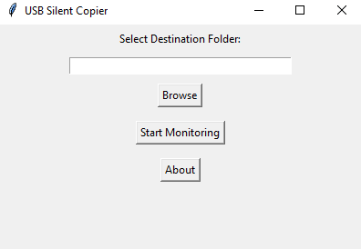

# USB Silent Copier

## Description

USB Silent Copier is a Python-based utility that automatically detects and copies files from any connected USB drive to a specified destination folder. It runs in the background and minimizes to the system tray while monitoring USB devices.

## Features

- Automatically detects USB drives upon connection
- Copies all files from the USB to a chosen destination
- Runs silently in the background with a system tray icon
- Simple GUI for selecting the destination folder

## Screenshot



## Requirements

Before running the script, ensure you have Python installed and install the required dependencies.

### Install Dependencies

Install required libraries using:
   ```bash
   pip install -r requirements.txt
   ```

```
psutil
pystray
pillow
tkinter
pyinstaller
```

## System Tray Functionality

Once minimized, the app continues running in the system tray. To close it, right-click the tray icon and select "Exit."

## About

- **Version**: 1.0
- **Creator**: Darkus
- **Year**: 2025
